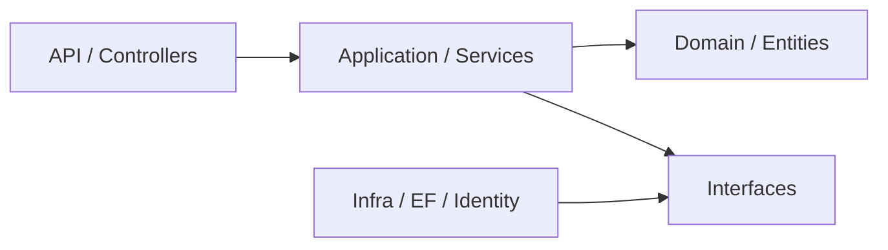

One of the hardest parts of learning programming is turning theory into something concrete.
Classic examples like "Car" or "Animal" can be useful at first, but they rarely reflect real software problems.

That is why many beginners struggle to internalize these concepts. In software development, understanding usually comes from applying ideas in real scenarios and seeing the trade-offs in practice.

To do that, we will use a small but practical [project](https://github.com/lucasestevesr/GoodHamburger) as our base:



> Before diving into OOP itself, notice that the [project structure](https://github.com/lucasestevesr/GoodHamburger/tree/master/src) already reflects an important SOLID principle: **SRP**.
> Each layer and each core class in the flow has a dominant responsibility. Controllers handle HTTP concerns, services orchestrate use cases, entities capture business rules, and repositories deal with persistence.
> This separation reduces coupling and makes evolution safer.

OOP is built on four core principles: **Encapsulation, Abstraction, Inheritance, and Polymorphism.**

We will start with **Encapsulation**, because it is easier to observe in the most important layer of this architecture: the **Domain**.

#### Encapsulation in a real context

In Clean Architecture, the **Domain** layer is the core of the system.
It should not depend on other layers and should hold the business rules.

That is why encapsulation becomes so visible there.

Encapsulation is not just about access modifiers like `private`, `public`, or `protected`.
It is about ensuring internal state can only be accessed and changed in controlled ways, so domain invariants are preserved.

In practice, look at [Order.cs](https://github.com/lucasestevesr/GoodHamburger/blob/master/src/GoodHamburger.Domain/Entities/Orders/Order.cs).
It has a collection of order items:

```csharp
private readonly List<OrderItem> _items = new();
```

This design carries two important decisions:

- `private` blocks direct access to the list from outside `Order`.
- `readonly` prevents replacing the list reference after initialization.

```csharp
class Product
{
    ...
    var orderItems = order._items; // compilation error: '_items' is inaccessible due to its protection level
}

_items = new List<OrderItem>(); // not allowed
```

Now imagine the list were public.

```csharp
class Product
{
    ...
    order.Items.Add(item);
}
```

In that case, any part of the system could add items without validation.
That breaks business rules and can push the object into an invalid state.

To avoid this, we do not expose the list directly.
Instead, we expose methods that control mutations:

```csharp
public void AddItem(Product product, int quantity)
{
    if (quantity <= 0)
        throw new DomainException("Quantity must be greater than zero.");

    _items.Add(new OrderItem(product, quantity));
}
```

No one changes `_items` directly, and every change flows through validations.
As a result, **the object stays consistent**.

Now look at a practical example of poor modeling.
In [Product.cs](https://github.com/lucasestevesr/GoodHamburger/blob/master/src/GoodHamburger.Domain/Entities/Products/Product.cs), there are multiple public properties with public getters and setters.
For example: `public decimal Price { get; set; }`.

With this model, any part of the system could do this:

```csharp
product.Price = -99999.99m;
```

That violates a basic domain rule: a product cannot have a negative price.
In other words, the **object** is now in an **invalid state**.

A better approach is to encapsulate the property.
First, restrict direct mutation:

```csharp
public decimal Price { get; private set; }
```

Then expose controlled behavior:

```csharp
public void ChangePrice(decimal price)
{
    if (price <= 0)
        throw new DomainException("Price must be greater than zero.");

    Price = price;
}
```

Now the property is truly encapsulated: we control who changes state and guarantee validity.

At this point, encapsulation becomes clearer. It is not just about "hiding data".
It is about guaranteeing that:

- internal state is never manipulated directly from outside
- every state transition goes through business rules
- the object never enters an invalid state

> Objects should not expose raw data for uncontrolled manipulation.
> They should expose behaviors that preserve that data's consistency.

#### Abstraction

Following the system flow, we can now discuss **Abstraction**, which is easy to observe in the **Application** layer, where business orchestration meets external dependencies (data persistence, APIs, and so on).

Abstraction is one of the most important OOP concepts, and it is directly tied to architectural principles like SOLID's **Dependency Inversion Principle (DIP)**.

To fully understand dependency inversion, you first need to understand dependency injection and, by extension, abstraction itself.

In object-oriented design, abstraction means exposing only what is necessary while hiding implementation details.
It separates **"what something does"** from **"how it does it."**

Take [OrderService](https://github.com/lucasestevesr/GoodHamburger/blob/master/src/GoodHamburger.Application/Orders/Services/OrderService.cs).
This class handles order creation, retrieval, updates, and removal, and coordinates business flow:

```csharp
public sealed class OrderService(
    IOrderRepository orders,
    IProductRepository products,
    IIdentityService identityService,
    ICurrentUser currentUser) : IOrderService
```

Here, `IOrderRepository` and `IProductRepository` are contracts that abstract data access.

`OrderService` depends on abstractions, not concrete implementations (such as Entity Framework or raw SQL).

Keep this question in mind:

> Does this class really need to know *how* data is persisted?

Without abstractions, we might write something like this:

```csharp
public class OrderService
{
    private readonly OrderRepository _repository = new OrderRepository();

    public void CreateOrder(Guid orderId)
    {
        _repository.Save(order);
    }
}
```

Now `OrderService` is tightly coupled, and changes in repository implementation leak into service logic.

Imagine the repository API changes:

```csharp
// before
Save(Order order)

// after
Save(Order order, Transaction tx)
```

Then `OrderService` also needs to change:

```csharp
public class OrderService
{
    private readonly OrderRepository _repository = new OrderRepository();

    public void CreateOrder(Guid orderId)
    {
        // new infrastructure details leaking into business flow
        _repository.Save(order, tx);
    }
}
```

An infrastructure change now directly impacts business logic.
That makes the system rigid and harder to evolve. Even small changes can cascade.

With **abstraction**, the service depends only on repository contracts.
The implementation can change without forcing service changes.
You can replace the database, ORM, or persistence strategy without rewriting business orchestration.

So when you apply abstraction, you are also moving toward SOLID's DIP:

> High-level modules (`OrderService`) should not depend on low-level modules (`OrderRepository`).
> Both should depend on abstractions (`IOrderRepository`).

Back to the earlier question:
No, business-rule classes do not need infrastructure details.

In short:

> Abstraction means exposing only what the consumer needs to know,
> keeping business behavior focused,
> isolating technical details,
> and increasing system flexibility.

Now the architecture is easier to read:
Abstraction defines contracts.
DIP drives the architecture to depend on those contracts.
DI is the mechanism used to provide concrete implementations.

Another relevant principle here is **ISP (Interface Segregation Principle)**.

In the project, [IIdentityService](https://github.com/lucasestevesr/GoodHamburger/blob/master/src/GoodHamburger.Application/Identity/Interfaces/IIdentityService.cs) currently groups too many responsibilities: authentication, user queries, role checks, and user management.
It works, but it creates an overly broad contract.
As the system evolves, it would likely be more cohesive to split it into smaller interfaces such as `IAuthenticationService`, `IUserQueryService`, and `IUserManagementService`.

#### Inheritance

Inheritance is powerful, but also easy to misuse.
The concept itself is simple; applying it well is not.
When misapplied, it leads to high coupling, rigidity, and difficult evolution.

In real projects, inheritance often appears through **abstract base classes**.

In this project, we have [BaseEntity](https://github.com/lucasestevesr/GoodHamburger/blob/master/src/GoodHamburger.Domain/Entities/Base/BaseEntity.cs).
As the name suggests, it is a base entity for other entities:

```csharp
namespace GoodHamburger.Domain.Entities.Base
{
    public abstract class BaseEntity
    {
        public Guid Id { get; set; } = Guid.NewGuid();

        public DateTimeOffset CreationDate { get; set; }
    }
}
```

The `abstract` modifier indicates this class is meant to be inherited, not instantiated directly.
Its members make sense through derived classes.

That is inheritance in action.
It lets us share structure and behavior across related classes.

Aligned with SOLID's **SRP (Single Responsibility Principle)**, each class should have one reason to change.
By extracting common fields into `BaseEntity`, we reduce duplication, keep entities focused, and centralize shared changes.

```csharp
public class Order : BaseEntity
{
    // No need to redefine Id or CreationDate.
    // Focus only on domain-specific concerns.
    ...
    public OrderStatus Status { get; set; }
}
```

But we need to be careful:

```csharp
namespace GoodHamburger.Domain.Entities.Base
{
    public abstract class BaseEntity
    {
        public Guid Id { get; set; } = Guid.NewGuid();

        public DateTimeOffset CreationDate { get; set; }

        // If we add unrelated members to the base class...
        public Product Product { get; set; }
        // ...all derived entities now inherit Product as well.
    }
}
```

Now **every class inheriting `BaseEntity` gets that property**, even when it makes no domain sense.
That pollutes entities, introduces accidental coupling, and breaks semantic clarity.

When using inheritance, sharing structure is not enough.
Derived classes must still honor what the base class represents.
That is the **Liskov Substitution Principle (LSP)**.

In other words, if one class inherits from another, it should be usable in place of the base type without breaking expected behavior.

In this project, `BaseEntity` is a safe use because it shares only identity and creation date, without forcing irrelevant behavior onto derived entities.
That discipline helps prevent artificial inheritance hierarchies.

Remember:

> Inheritance is not a code reuse trick.
> It is a domain-modeling tool.

#### Polymorphism

Among OOP paradigms, this is often the one most used in production systems.

Polymorphism is the ability to model different behaviors behind the same abstraction.
Instead of packing every variation into a single class with many `if` blocks, we model each rule as its own object.

In this project, discount calculation is still centralized in [Order.cs](https://github.com/lucasestevesr/GoodHamburger/blob/master/src/GoodHamburger.Domain/Entities/Orders/Order.cs), inside `CalculateDiscountRate`.
That works for a few combinations, but it becomes harder to evolve as rules grow.

If discount rules change frequently, a better approach is to represent each rule as an `IDiscountPolicy` implementation.
At that point, the code stops asking "which case is this?" and starts delegating to specialized objects.
That is practical polymorphism.

```csharp
private decimal CalculateDiscountRate()
{
    var hasBurger = _items.Any(i => i.Category == ProductCategory.Burger);
    var hasSide = _items.Any(i => i.Category == ProductCategory.Side);
    var hasDrink = _items.Any(i => i.Category == ProductCategory.Drink);

    if (hasBurger && hasSide && hasDrink) return 0.20m;
    if (hasBurger && hasDrink) return 0.15m;
    if (hasBurger && hasSide) return 0.10m;

    return 0m;
}
```

Notice how this method must explicitly handle each case.
As product types and discount rules expand, this `if` block tends to grow uncontrollably.

We can refactor this with a contract:

> This refactor improves more than polymorphism.
> It also moves the code closer to **OCP**: the entity no longer needs to change whenever a new discount rule appears, and the system evolves mainly through extension.

```csharp
public interface IDiscountPolicy
{
    bool AppliesTo(Order order);
    decimal GetDiscountRate(Order order);
}
```

Now each rule becomes an implementation:

```csharp
public sealed class BurgerDrinkPolicy : IDiscountPolicy
{
    public bool AppliesTo(Order order)
    {
        var hasBurger = order.Items.Any(i => i.Category == ProductCategory.Burger);
        var hasDrink = order.Items.Any(i => i.Category == ProductCategory.Drink);
        var hasSide = order.Items.Any(i => i.Category == ProductCategory.Side);

        return hasBurger && hasDrink && !hasSide;
    }

    public decimal GetDiscountRate(Order order) => 0.15m;
}
```

And a coordinator applies the policies:

```csharp
public sealed class DiscountCalculator
{
    private readonly IReadOnlyCollection<IDiscountPolicy> _policies;

    public DiscountCalculator(IEnumerable<IDiscountPolicy> policies)
    {
        _policies = policies.ToList();
    }

    public decimal Calculate(Order order)
    {
        return _policies
            .Where(policy => policy.AppliesTo(order))
            .Select(policy => policy.GetDiscountRate(order))
            .DefaultIfEmpty(0m)
            .Max();
    }
}
```

At first glance, this may look more verbose.
But with SOLID in mind, entities should be open for extension and closed for modification.
In practice: if a rule changes frequently, turn that variation into an object.

We trade initial simplicity for long-term flexibility and scalability.

Polymorphism lets us replace condition-heavy branches with object behavior,
decouple business rules,
and evolve the system with less friction.

In short:

> Different objects can honor the same contract while providing different behaviors.

#### Conclusion

Designing for scalability, flexibility, and low coupling is a real differentiator.
Thinking about architecture early matters.
It is hard to justify heavy work on cloud FinOps or database tuning if the core model is fragile.

Systems evolve.
Rules change.
New demands appear.
Without a well-modeled foundation, each change tends to increase coupling and regression risk.

OOP concepts and SOLID principles exist precisely to support software evolution over time.
At project start, this trade-off can feel unnecessary.
But if the goal is to scale, careful modeling pays off.

In the end, OOP and SOLID are not isolated theory.
They are practical tools to solve real problems of:

- coupling
- system evolution
- business-rule maintainability

And they only make sense when applied in the context of real software.
