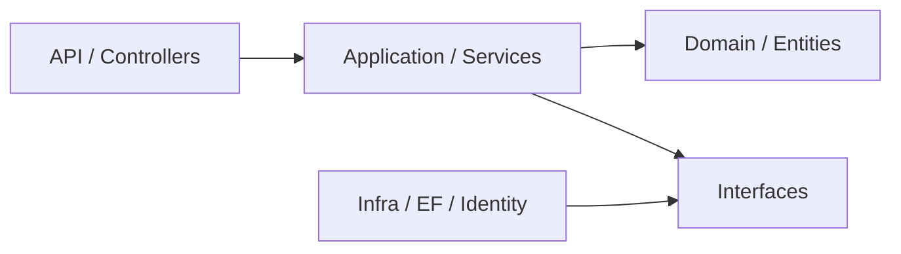

Uma das grandes dificuldades ao estudar programação é abstrair conteúdos teóricos sem enxergar sua aplicação prática.  
Exemplos clássicos como “Carro” ou “Animal”, usados para introduzir OOP, ajudam apenas como introdução, mas são superficiais e pouco conectados com problemas reais.

Por isso, é comum que o programador iniciante não abstraia o conteúdo. Mas como todos sabemos, em programação, a forma mais eficaz de compreender conceitos é aplicar e observar a teoria em cenários concretos.

Para isso, vamos utilizar como base um [projeto](https://github.com/lucasestevesr/GoodHamburger) pequeno, mas com utilidade real:




> Antes de falar dos pilares de OOP, vale notar que a estrutura do [projeto](https://github.com/lucasestevesr/GoodHamburger/tree/master/src) já mostra um princípio importante do SOLID: o **SRP**.  
   Cada camada e cada classe principal do fluxo possuem uma responsabilidade predominante. Controllers tratam a interface HTTP, services orquestram casos de uso, entidades concentram regras de negócio e repositórios lidam com persistência.  
   Essa separação reduz acoplamento e facilita evolução.

Voltando, a OOP baseia em quatro princípios básicos: **Encapsulamento, Abstração, Herança e Polimorfismo.**

Vamos começar pelo **Encapsulamento**, pois ele é mais facilmente observado na camada mais importante da arquitetura: o **Domain**.
#### Encapsulamento no contexto real

Na Clean Architecture, a camada **Domain** é o núcleo do sistema.  
Ela não deve depender de nenhuma outra camada e é responsável por concentrar as regras de negócio.

Por isso, é nela que o encapsulamento se torna mais evidente.

Encapsular não significa apenas usar modificadores de acesso como `private, public ou protected`.  
Encapsulamento é garantir que o estado interno de um objeto só possa ser acessado e modificado de forma controlada, preservando sempre a consistência das regras de negócio (invariantes).

Vamos para a prática, veja [Ordes.cs](https://github.com/lucasestevesr/GoodHamburger/blob/master/src/GoodHamburger.Domain/Entities/Orders/Order.cs) 
Temos uma propriedade que é uma coleção de itens.

```csharp
 private readonly List<OrderItem> _items = new();
```
Ela foi pensada da seguinte forma, tenho uma ordem e essa ordem deve ter vários produtos.
Aqui existem dois pontos importantes.
- Um modificador de acesso `private` que impede acesso direto à lista fora da classe `Order`.
- Um modificador de campo `readonly` que impede que a referência da lista seja substituída após a inicialização. 

```csharp
class Product
{
	...
	var listaDeItemsNoPedido = order._items; // erro de compilação: '_items' é inacessível devido ao seu nível de proteção
}

_items = new List<OrderItem>(); // não permitido
```

Agora, imagine se essa lista fosse pública.

```csharp
class Product
{
	...
	order.Items.Add(item);
}
```

Nesse cenário, qualquer parte do sistema poderia adicionar itens sem passar por validações.  
Isso quebraria regras de negócio e poderia deixar o objeto em um estado inválido.

Para evitar esse problema, não expomos diretamente a lista, em vez disso, criamos métodos que controlam a modificação.

```csharp
public void AddItem(Product product, int quantity)
{
    if (quantity <= 0)
        throw new DomainException("Quantidade deve ser maior que zero.");

    _items.Add(new OrderItem(product, quantity));
}
```

ninguém altera `_items` diretamente e toda modificação passa por validações; 
Por fim o **objeto mantém sua consistência**.

Agora vamos observar no código um exemplo prático de uma modelagem ruim para um objeto.
Observe a classe [Product](https://github.com/lucasestevesr/GoodHamburger/blob/master/src/GoodHamburger.Domain/Entities/Products/Product.cs);
Nela temos várias propriedades públicas com *getters e setters* também públicos. [^1] 
Vejamos então a propriedade: `public decimal Price { get; set; }`.

Da forma que foi modelada, permitimos que em qualquer parte do sistema possamos fazer algo como 
```csharp
	product.Price = -99999.99m;
```
E isso viola uma regra básica do domínio, um produto não pode ter preço negativo.
Ou seja, o **objeto** entra em um **estado inválido**.

Então vamos aplicar o encapsulamento corretamente para essa prop.
Primeiro, restringimos o acesso:

```csharp
public decimal Price { get; private set; }
```

Agora, apenas a própria classe pode modificar o valor, em seguida, expomos um comportamento controlado:

```csharp
public void ChangePrice(decimal price)
{
    if (price <= 0)
        throw new DomainException("Preço deve ser maior que zero.");

    Price = price;
}
```

Agora temos uma propriedade encapsulada, pois temos o controle sobre quem altera o estado e a garantia de que o objeto nunca ficará inválido.

Agora fica fácil entender de fato o encapsulamento. Não é apenas esconder dado e utilizar modificadores de acesso.

É garantir que:

- o estado interno de um objeto não seja manipulado diretamente
- todas as mudanças passem por regras de negócio
- o objeto nunca entre em um estado inválido

> Objetos não devem expor dados para serem manipulados.  
> Devem expor comportamentos que garantam a consistência desses dados.
#### Abstração

Seguindo pelo fluxo do sistema, podemos estudar o conceito de **Abstração** pois ele é facilmente observado na camada que faz a orquestração entre as dependências externas (persistência de dados, APIs, etc) com o Domain; a camada **Application**.

A abstração é um dos conceitos mais importantes da OOP, pois está diretamente relacionada com princípios fundamentais de arquitetura, como a **Inversão de Dependência (DIP)** do SOLID.

Para entender a **Inversão de Dependência**, precisamos antes entender **Injeção de Dependência**, e, por consequência, o conceito de **abstração**.

Em orientação a objetos, abstração consiste em expor apenas o que é necessário, ocultando os detalhes de implementação.  
Ou seja, ela separa **“o que algo faz”** de **“como isso é feito”**.

Observe a classe [OrderService](https://github.com/lucasestevesr/GoodHamburger/blob/master/src/GoodHamburger.Application/Orders/Services/OrderService.cs). Essa classe é responsável por buscar, criar, atualizar e remover pedidos. Além disso, ela coordena as operações relacionadas ao fluxo de negócio.

```csharp
 public sealed class OrderService(
        IOrderRepository orders,
        IProductRepository products,
        IIdentityService identityService,
        ICurrentUser currentUser) : IOrderService
```

Aqui `IOrderRepository, IProductRepository` são os contratos responsáveis por abstrair todo o acesso ao banco.

A classe `OrderService` não depende de uma implementação concreta (por exemplo, Entity Framework ou SQL direto), mas apenas dessas abstrações.

Então vamos manter em mente a seguinte pergunta. 

>  - É necessário que ela saiba como os dados são persistidos no banco?

Se não fosse por esses contratos(abstrações), teríamos que inicializar o acesso ao repositório nessa classe;

```csharp
public class OrderService
{
    private readonly OrderRepository _repository = new OrderRepository();

    public void CreateOrder(Guid orderId)
    {
        _repository.Save(Order order);
    }
}
```

Assim, deixaríamos `OrderService` muito acoplada, e qualquer modificação nas classes de repositório impactariam o funcionamento da nossa classe de serviço.

Imagine que no `Repository` troquemos uma implementação

```csharp
// antes
Save(Order order)

// depois
Save(Order order, Transaction tx)
```

Nesse cenário, o `OrderService` precisa ser alterado

```csharp
public class OrderService
{
    private readonly OrderRepository _repository = new OrderRepository();

    public void CreateOrder(Guid orderId)
    {
	    //implementações novas para corresponder ao novo metódo Save
        _repository.Save(order, tx);
    }
}
```

Uma mudança na infraestrutura impacta diretamente a regra de negócio deixando o sistema   rígido e difícil de evoluir. Até pequenas mudanças geram efeitos cascata.

Com **abstração**, a classe de serviço só depende do contrato do repositório, não conhecemos a implementação do repositório, ela pode mudar sem afetar a regra de negócio, podemos trocar banco, ORM ou estratégia de persistência sem alterar o serviço.

Aplicando o conceito de abstração, indiretamente estamos aplicando o DIP do SOLID.

> Módulos de alto nível (`OrderService`) não devem depender de módulos de baixo nível (`OrderRepository`).  
> Ambos devem depender de abstrações (`IOrderRepository`).

Lembra daquela pergunta? 

A resposta é clara agora; NÃO, não é necessário que quem contém a regra de negócio deve conhecer detalhes de infraestrutura.

Por fim, 

> abstração é expor apenas o que **o consumidor precisa saber**, permitindo que a lógica foque no comportamento, os detalhes técnicos fiquem isolados e o sistema fique mais flexível e desacoplado.

Agora conseguimos entender a estrutura do projeto; A abstração define o contrato. O DIP orienta a arquitetura a depender desse contrato. E o DI é apenas o mecanismo usado para fornecer a implementação concreta.

Outro princípio importante aqui é o **ISP (Interface Segregation Principle)**.

No projeto, [IIdentityService](https://github.com/lucasestevesr/GoodHamburger/blob/master/src/GoodHamburger.Application/Identity/Interfaces/IIdentityService.cs); concentra responsabilidades demais: autenticação, consulta de usuários, verificação de roles e operações de cadastro.
Isso funciona, mas cria um contrato muito amplo. Em uma evolução do sistema, seria mais coeso separar essa interface em contratos menores, como `IAuthenticationService, IUserQueryService e IUserManagementService`.
#### Herança

Herança é um conceito poderoso, mas também perigoso. É fácil entender mas é difícil saber aplicar corretamente.
Quando mal aplicada, pode gerar uma modelagem ruim, como alto acoplamento, rigidez no código, dificuldade de evolução.

Em projetos reais, é comum utilizar herança por meio de **classes abstratas**.

No nosso projeto, temos a classe [BaseEntity](https://github.com/lucasestevesr/GoodHamburger/blob/master/src/GoodHamburger.Domain/Entities/Base/BaseEntity.cs). Como o próprio nome sugere, ela é uma entidade base para as demais entidades.

```csharp
namespace GoodHamburger.Domain.Entities.Base
{
    public abstract class BaseEntity
    {
        public Guid Id { get; set; } = Guid.NewGuid();

        public DateTimeOffset CreationDate { get; set; }
    }
}
```

Utilizamos o modificador `abstract` justamente para indicar que essa classe foi projetada para ser herdada, ou seja, ela não pode ser instanciada diretamente.

Assim, suas propriedades, campos e métodos só fazem sentido quando utilizados por classes derivadas (classes filhas).

E como isso é feito? Via Herança.

A herança serve para compartilhar estrutura e/ou comportamento ente classes.

Seguindo o **SRP (Single Responsibility Principle)** do **SOLID**, uma classe deve ter apenas uma razão para mudar. Ao extrair propriedades comuns para `BaseEntity`, evitamos duplicação de código, mantemos cada entidade focada em sua responsabilidade e centralizamos mudanças em um único lugar.

```csharp
public class Order : BaseEntity  
{  
	//Não precisamos criar propriedades de Id e CreationDate novamente.
	//Focamos nas propriedades específicas desse dominío.
	//...
	public OrderStatus Status { get; set; }
}
```

mas é importante ter cuidado pois;

```csharp
namespace GoodHamburger.Domain.Entities.Base
{
    public abstract class BaseEntity
    {
        public Guid Id { get; set; } = Guid.NewGuid();

        public DateTimeOffset CreationDate { get; set; }
        
        //Se criarmos qualquer propriedade, metódo, ou campo na classe pai.
        public Product Product { get; set; }
		//Agora, todas as entidades que herdam de BaseEntity terão Product.
    }
}
```

Nesse caso, **todas as classes que herdam de `BaseEntity` passarão a ter essa propriedade**, mesmo que ela não faça sentido para o domínio delas.
Gerando problemas graves como poluições das entidades, acoplamento indevido e quebra semântica das entidades de domínio.

Quando usamos herança, não basta compartilhar estrutura: a classe derivada também precisa respeitar as expectativas da classe base. 
Esse é o **princípio da substituição de Liskov**(LSP).  
Em outras palavras, se uma classe herda de outra, ela deve poder ser usada no lugar da classe base sem quebrar o comportamento esperado do sistema.  
No projeto, BaseEntity é um exemplo seguro porque ela compartilha apenas identidade e data de criação, sem impor comportamentos que as entidades derivadas não consigam cumprir.  
Esse cuidado ajuda a evitar heranças artificiais, em que a subclasse herda membros que não fazem sentido para seu domínio.

Lembre-se;

> Herança não é uma ferramenta de reutilização de código! É uma ferramenta de modelagem de domínio.

#### Polimorfismo
Esse é, dos paradigmas da OOP, o mais utilizado em produção real de software; 

Polimorfismo é a capacidade de representar comportamentos diferentes sob a mesma abstração.  
Em vez de concentrar todas as variações dentro de uma única classe usando vários `if`s, podemos modelar cada regra como um objeto com comportamento próprio.

No projeto, o cálculo de desconto ainda está centralizado em [Order](https://github.com/lucasestevesr/GoodHamburger/blob/master/src/GoodHamburger.Domain/Entities/Orders/Order.cs).CalculateDiscountRate.` Isso funciona para poucas combinações, mas dificulta a evolução da regra.

Se o desconto passar a variar com frequência, uma alternativa melhor é representar cada política de desconto como uma implementação de `IDiscountPolicy`. Nesse modelo, o cálculo deixa de perguntar “qual caso é esse?” e passa a delegar a decisão para objetos especializados. Esse é o uso prático do polimorfismo.
```csharp
private decimal CalculateDiscountRate()
{
	var hasBurger = _items.Any(i => i.Category == ProductCategory.Burger);
	var hasSide = _items.Any(i => i.Category == ProductCategory.Side);
	var hasDrink = _items.Any(i => i.Category == ProductCategory.Drink);

	if (hasBurger && hasSide && hasDrink) return 0.20m;
	if (hasBurger && hasDrink) return 0.15m;
	if (hasBurger && hasSide) return 0.10m;

	return 0m;
}
```


Observe que para a regra ser implementada, o comportamento do método `CalculateDiscountRate` necessita trabalhar com cada caso específico. Se formos adicionando mais produtos e mais regras de desconto, imagine como ficaria esse bloco de `ifs`...

Podemos refatorar essa lógica utilizando um contrato

> Esse refatoração não melhora apenas o polimorfismo. Ela também aproxima o código do **OCP**: a entidade deixa de precisar ser modificada sempre que surge uma nova política de desconto, e o sistema passa a evoluir principalmente por extensão.
> 

```csharp
public interface IDiscountPolicy
{
    bool AppliesTo(Order order);
    decimal GetDiscountRate(Order order);
}
```

Agora, cada regra vira uma implementação:

```csharp
public sealed class BurgerDrinkPolicy : IDiscountPolicy
{
    public bool AppliesTo(Order order)
    {
        var hasBurger = order.Items.Any(i => i.Category == ProductCategory.Burger);
        var hasDrink = order.Items.Any(i => i.Category == ProductCategory.Drink);
        var hasSide = order.Items.Any(i => i.Category == ProductCategory.Side);

        return hasBurger && hasDrink && !hasSide;
    }

    public decimal GetDiscountRate(Order order) => 0.15m;
}
```

E um orquestrador aplica as políticas

```csharp
public sealed class DiscountCalculator
{
    private readonly IReadOnlyCollection<IDiscountPolicy> _policies;

    public DiscountCalculator(IEnumerable<IDiscountPolicy> policies)
    {
        _policies = policies.ToList();
    }
    
    public decimal Calculate(Order order)
    {
        return _policies
            .Where(policy => policy.AppliesTo(order))
            .Select(policy => policy.GetDiscountRate(order))
            .DefaultIfEmpty(0m)
            .Max();
    }
    
}
```

Parece que deixamos o código mais verboso, certo?
Mas seguindo o SOLID, as entidades devem estar abertas para extensão e fechadas para modificação. Na prática: se uma regra varia muito, tente transformar essa variação em objeto.
Trocamos a simplicidade inicial por uma estratégia de flexibilidade e escalabilidade.

O Polimorfismo permite substituir essas condicionais por comportamento de objeto, desacoplar as regras e facilitar a evolução do sistema. Ou seja, 
> diferentes objetos podem responder ao mesmo contrato com comportamentos distintos.

#### Conclusão

Modelar um sistema para ser escalável, flexível e desacoplado é um diferencial.  
E pensar nessa arquitetura desde o início é essencial. Pouco adianta investir em estratégias de FinOps, otimizações de performance na cloud ou no banco de dados se a base do código está mal modelada.

Lembre-se sistemas evoluem, regras mudam, novas demandas surgem.  
Sem uma base bem modelada, cada mudança tende a aumentar o acoplamento e o risco de regressão.
Os conceitos de OOP e os princípios do SOLID foram pensados justamente para permitir a evolução do software ao longo do tempo.  
No início de um projeto, esse trade-off pode parecer desnecessário, mas, se a intenção é escalar o sistema, esse cuidado com a modelagem se paga. E muito.

No fim, OOP e SOLID não são conceitos isolados.

Eles são ferramentas para resolver problemas reais de:

- acoplamento
- evolução do sistema
- manutenção de regras de negócio

E só fazem sentido quando aplicados no contexto de um sistema real.

[^1]: Getters e setters são métodos especiais em orientação a objetos usados para acessar (`get`) e modificar (`set`) atributos privados de uma classe de forma controlada
